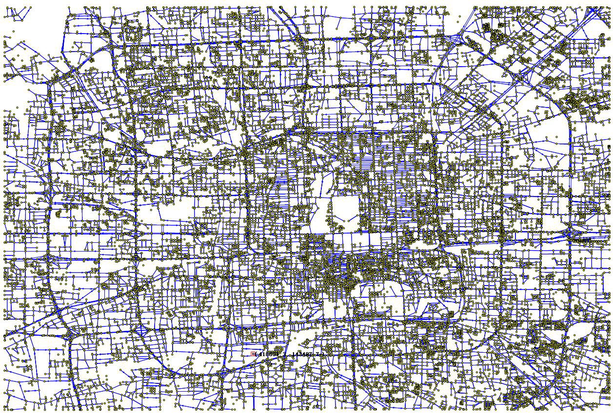
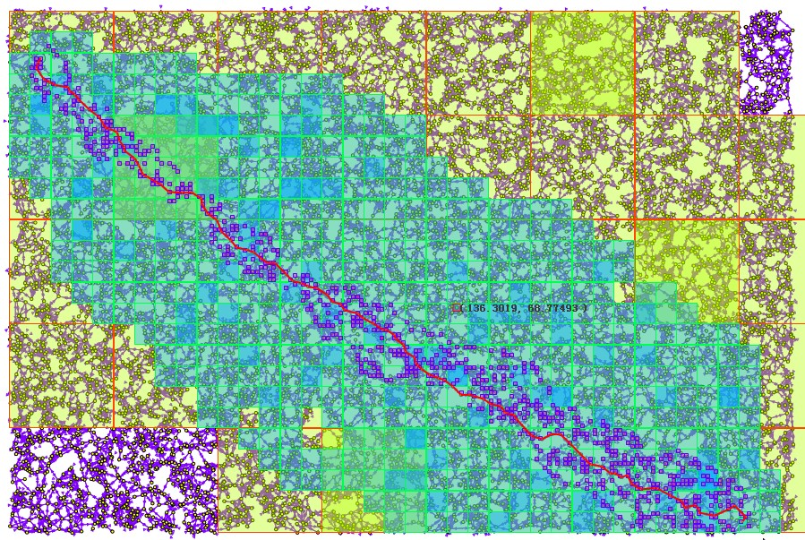
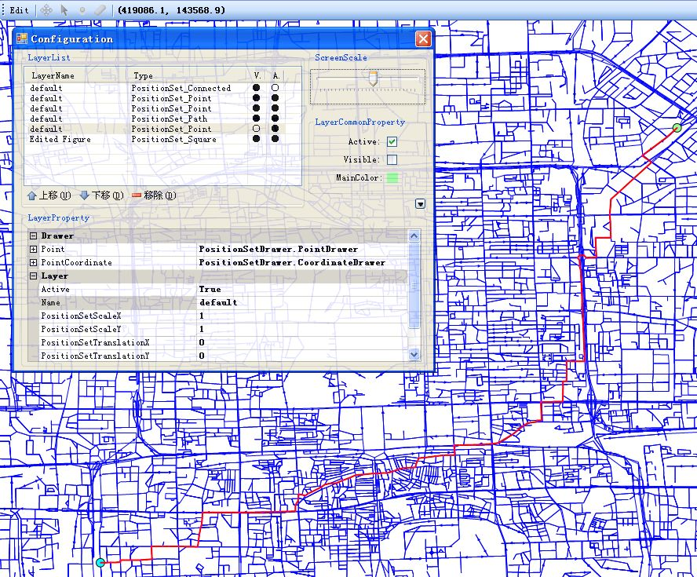

# AI Algorithm Platform
Automatically exported from code.google.com/p/ai-algorithmplatform

AI Algorithm Platform -- a series of AI agorithms, including convex hull, nearest neighbor, pathfinding and concollision detection. (Written in C#)

We both develop some classic algorithms, and some new algorithms based on our M2M Model, which is an new approach to implement these algorithms efficiently.

## The M2M Pathfinding Algorithm
Macro-to-micro (M2M) model is an implementation model that inherits the GrC idea
and extends it to some additional highly desirable characteristics. In this
paper we introduce an effective pathfinding algorithm based on the M2M model.
This algorithm takes O(n) time to preprocess, constructing the M2M data
structure. Such hierarchical structure occupies O(n) bit memory space and can be
updated in O(1) expected time to handle changes. Although the resulting path is
not always the shortest one, it can make a trade-off between accuracy and time
cost by adjusting a parameter - range value to satisfy various applications. At
last, we will discuss the advantages of the M2M pathfinding algorithm (M2M-PF)
and demonstrate the academic and applied prospect of M2M model.

## Example - A traffic map of Beijing
Different levels of abstract for the map:
### Original

### Intermediate

### A result path in the map (the line in red):

## For more details, please refer to our papers:

[1] H. Wan, Y. Zhang, S. Luo, R. Liu, and W. Ye, “The M2M Pathfinding Algorithm Based on the Idea of Granular Computing,” in 2009 IEEE/WIC/ACM International Joint Conference on Web Intelligence and Intelligent Agent Technology, 2009, vol. 2, pp. 533–540.
[pdf](pathfinding_2009.pdf)

[2] H. Wan, Z. Zhang, and R. Liu, “A Parallel Dynamic Convex Hull Algorithm Based on the Macro to Micro Model,” in 2009 2nd International Congress on Image and Signal Processing, 2009, pp. 1–5.
[pdf](convex_hull_2009.pdf)
